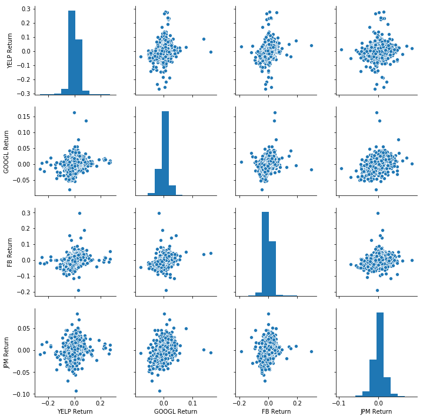
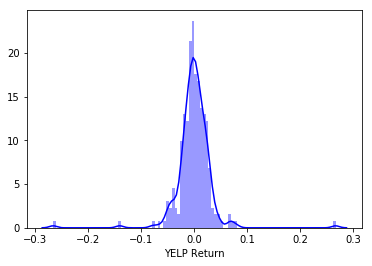
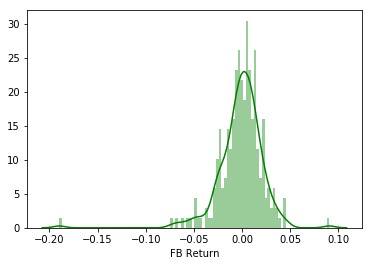
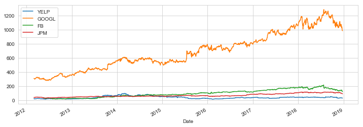
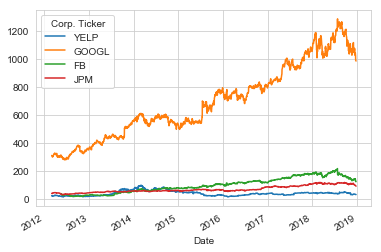
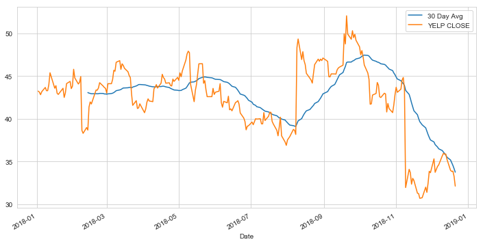
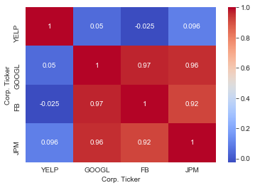
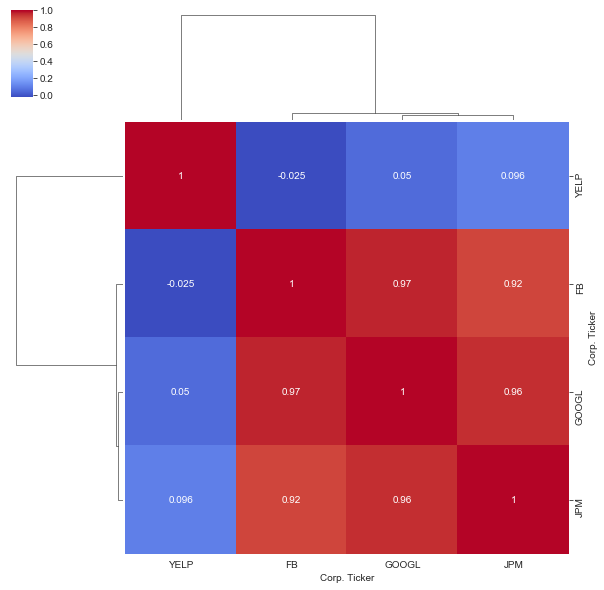

# Finance Data Project

In this data project I focused on exploratory data analysis of stock prices of Yelp and compared with stock prices of Google, Facebook, and JPMorgan. 
I focused on stocks progression throughout the IPO of Yelp March 2012 to December 2018.

This project inspired by *Python for Data Science and Machine Learning Bootcamp, Udemy*, taught by Jose Portilla

## Get the Data

Pandas was used to directly read data from Yahoo finance!

First thing to do is to import necessary modules.

*Note: [You'll need to install pandas-datareader for this to work!](https://github.com/pydata/pandas-datareader) Pandas datareader allows you to [read stock information directly from the internet](http://pandas.pydata.org/pandas-docs/stable/remote_data.html) Use these links for install guidance (**pip install pandas-datareader**)*


```python
from pandas_datareader import data, wb
import pandas as pd
import numpy as np
import datetime
%matplotlib inline
```

## Data

We need to get data using pandas datareader. We will get stock information for the following companies:
* Yelp
* Google
* Facebook
* JPMorgan Chase

**Key steps to consider:**
1. Use datetime to set start and end datetime objects.
2. Determine ticker symbol for each company.
2. Use datareader to grab details on the stock.

**Use [this documentation page](https://pandas-datareader.readthedocs.io/en/latest/remote_data.html) for details and instructions:**


```python
#initialize the start and end parameter
start = datetime.datetime(2012, 3, 2)
end = datetime.datetime(2018, 12, 24)
```


```python
# Yelp
YELP = data.DataReader("YELP", 'yahoo', start, end)

# Google
GOOGL = data.DataReader("GOOGL", 'yahoo', start, end)

# Facebook
FB = data.DataReader("FB", 'yahoo', start, end)

# JPMorgan Chase
JPM = data.DataReader("JPM", 'yahoo', start, end)


# Conccatinate data to dataframe
tickers = "YELP GOOGL FB JPM"
tickers=tickers.split()

df = pd.concat([YELP,GOOGL,FB,JPM], axis=1,keys=tickers)

```


```python
# Could also do this for a Panel Object
#df = data.DataReader(['YELP', 'GOOGL', 'FB', 'JPM'],'yahoo', start, end)
df.head()
```


<div>
<table border="1" class="dataframe">
  <thead>
    <tr>
      <th></th>
      <th colspan="6" halign="left">YELP</th>
      <th colspan="4" halign="left">GOOGL</th>
      <th>...</th>
      <th colspan="4" halign="left">FB</th>
      <th colspan="6" halign="left">JPM</th>
    </tr>
    <tr>
      <th></th>
      <th>High</th>
      <th>Low</th>
      <th>Open</th>
      <th>Close</th>
      <th>Volume</th>
      <th>Adj Close</th>
      <th>High</th>
      <th>Low</th>
      <th>Open</th>
      <th>Close</th>
      <th>...</th>
      <th>Open</th>
      <th>Close</th>
      <th>Volume</th>
      <th>Adj Close</th>
      <th>High</th>
      <th>Low</th>
      <th>Open</th>
      <th>Close</th>
      <th>Volume</th>
      <th>Adj Close</th>
    </tr>
    <tr>
      <th>Date</th>
      <th></th>
      <th></th>
      <th></th>
      <th></th>
      <th></th>
      <th></th>
      <th></th>
      <th></th>
      <th></th>
      <th></th>
      <th></th>
      <th></th>
      <th></th>
      <th></th>
      <th></th>
      <th></th>
      <th></th>
      <th></th>
      <th></th>
      <th></th>
      <th></th>
    </tr>
  </thead>
  <tbody>
    <tr>
      <th>2012-03-02</th>
      <td>26.000000</td>
      <td>22.000000</td>
      <td>22.010000</td>
      <td>24.58</td>
      <td>4809400</td>
      <td>24.58</td>
      <td>312.312317</td>
      <td>310.470459</td>
      <td>311.311310</td>
      <td>310.935944</td>
      <td>...</td>
      <td>NaN</td>
      <td>NaN</td>
      <td>NaN</td>
      <td>NaN</td>
      <td>40.880001</td>
      <td>40.230000</td>
      <td>40.430000</td>
      <td>40.630001</td>
      <td>34897900.0</td>
      <td>33.831562</td>
    </tr>
    <tr>
      <th>2012-03-05</th>
      <td>24.860001</td>
      <td>20.900000</td>
      <td>24.850000</td>
      <td>20.99</td>
      <td>2988200</td>
      <td>20.99</td>
      <td>311.556549</td>
      <td>305.996002</td>
      <td>310.525513</td>
      <td>307.432434</td>
      <td>...</td>
      <td>NaN</td>
      <td>NaN</td>
      <td>NaN</td>
      <td>NaN</td>
      <td>40.709999</td>
      <td>40.000000</td>
      <td>40.700001</td>
      <td>40.400002</td>
      <td>30806900.0</td>
      <td>33.640057</td>
    </tr>
    <tr>
      <th>2012-03-06</th>
      <td>20.500000</td>
      <td>19.360001</td>
      <td>19.830000</td>
      <td>20.50</td>
      <td>1154300</td>
      <td>20.50</td>
      <td>304.709717</td>
      <td>297.217224</td>
      <td>304.329315</td>
      <td>302.782776</td>
      <td>...</td>
      <td>NaN</td>
      <td>NaN</td>
      <td>NaN</td>
      <td>NaN</td>
      <td>39.869999</td>
      <td>39.119999</td>
      <td>39.450001</td>
      <td>39.320000</td>
      <td>33927500.0</td>
      <td>32.740757</td>
    </tr>
    <tr>
      <th>2012-03-07</th>
      <td>20.629999</td>
      <td>19.950001</td>
      <td>20.450001</td>
      <td>20.25</td>
      <td>444800</td>
      <td>20.25</td>
      <td>305.900909</td>
      <td>303.233246</td>
      <td>304.829834</td>
      <td>303.703705</td>
      <td>...</td>
      <td>NaN</td>
      <td>NaN</td>
      <td>NaN</td>
      <td>NaN</td>
      <td>40.060001</td>
      <td>39.380001</td>
      <td>39.459999</td>
      <td>39.950001</td>
      <td>22875100.0</td>
      <td>33.265347</td>
    </tr>
    <tr>
      <th>2012-03-08</th>
      <td>20.389999</td>
      <td>19.959999</td>
      <td>20.299999</td>
      <td>20.00</td>
      <td>436900</td>
      <td>20.00</td>
      <td>306.056061</td>
      <td>303.478485</td>
      <td>305.325317</td>
      <td>303.873871</td>
      <td>...</td>
      <td>NaN</td>
      <td>NaN</td>
      <td>NaN</td>
      <td>NaN</td>
      <td>40.750000</td>
      <td>40.220001</td>
      <td>40.470001</td>
      <td>40.439999</td>
      <td>22052300.0</td>
      <td>33.673359</td>
    </tr>
  </tbody>
</table>
<p>5 rows × 24 columns</p>
</div>


**Set the column name levels:**


```python
df.columns.names = ['Corp. Ticker','Stock Info']
```

**Check the head of the Corp. dataframe.**


```python
df.head()
```


<div>
<table border="1" class="dataframe">
  <thead>
    <tr>
      <th>Corp. Ticker</th>
      <th colspan="6" halign="left">YELP</th>
      <th colspan="4" halign="left">GOOGL</th>
      <th>...</th>
      <th colspan="4" halign="left">FB</th>
      <th colspan="6" halign="left">JPM</th>
    </tr>
    <tr>
      <th>Stock Info</th>
      <th>High</th>
      <th>Low</th>
      <th>Open</th>
      <th>Close</th>
      <th>Volume</th>
      <th>Adj Close</th>
      <th>High</th>
      <th>Low</th>
      <th>Open</th>
      <th>Close</th>
      <th>...</th>
      <th>Open</th>
      <th>Close</th>
      <th>Volume</th>
      <th>Adj Close</th>
      <th>High</th>
      <th>Low</th>
      <th>Open</th>
      <th>Close</th>
      <th>Volume</th>
      <th>Adj Close</th>
    </tr>
    <tr>
      <th>Date</th>
      <th></th>
      <th></th>
      <th></th>
      <th></th>
      <th></th>
      <th></th>
      <th></th>
      <th></th>
      <th></th>
      <th></th>
      <th></th>
      <th></th>
      <th></th>
      <th></th>
      <th></th>
      <th></th>
      <th></th>
      <th></th>
      <th></th>
      <th></th>
      <th></th>
    </tr>
  </thead>
  <tbody>
    <tr>
      <th>2012-03-02</th>
      <td>26.000000</td>
      <td>22.000000</td>
      <td>22.010000</td>
      <td>24.58</td>
      <td>4809400</td>
      <td>24.58</td>
      <td>312.312317</td>
      <td>310.470459</td>
      <td>311.311310</td>
      <td>310.935944</td>
      <td>...</td>
      <td>NaN</td>
      <td>NaN</td>
      <td>NaN</td>
      <td>NaN</td>
      <td>40.880001</td>
      <td>40.230000</td>
      <td>40.430000</td>
      <td>40.630001</td>
      <td>34897900.0</td>
      <td>33.831562</td>
    </tr>
    <tr>
      <th>2012-03-05</th>
      <td>24.860001</td>
      <td>20.900000</td>
      <td>24.850000</td>
      <td>20.99</td>
      <td>2988200</td>
      <td>20.99</td>
      <td>311.556549</td>
      <td>305.996002</td>
      <td>310.525513</td>
      <td>307.432434</td>
      <td>...</td>
      <td>NaN</td>
      <td>NaN</td>
      <td>NaN</td>
      <td>NaN</td>
      <td>40.709999</td>
      <td>40.000000</td>
      <td>40.700001</td>
      <td>40.400002</td>
      <td>30806900.0</td>
      <td>33.640057</td>
    </tr>
    <tr>
      <th>2012-03-06</th>
      <td>20.500000</td>
      <td>19.360001</td>
      <td>19.830000</td>
      <td>20.50</td>
      <td>1154300</td>
      <td>20.50</td>
      <td>304.709717</td>
      <td>297.217224</td>
      <td>304.329315</td>
      <td>302.782776</td>
      <td>...</td>
      <td>NaN</td>
      <td>NaN</td>
      <td>NaN</td>
      <td>NaN</td>
      <td>39.869999</td>
      <td>39.119999</td>
      <td>39.450001</td>
      <td>39.320000</td>
      <td>33927500.0</td>
      <td>32.740757</td>
    </tr>
    <tr>
      <th>2012-03-07</th>
      <td>20.629999</td>
      <td>19.950001</td>
      <td>20.450001</td>
      <td>20.25</td>
      <td>444800</td>
      <td>20.25</td>
      <td>305.900909</td>
      <td>303.233246</td>
      <td>304.829834</td>
      <td>303.703705</td>
      <td>...</td>
      <td>NaN</td>
      <td>NaN</td>
      <td>NaN</td>
      <td>NaN</td>
      <td>40.060001</td>
      <td>39.380001</td>
      <td>39.459999</td>
      <td>39.950001</td>
      <td>22875100.0</td>
      <td>33.265347</td>
    </tr>
    <tr>
      <th>2012-03-08</th>
      <td>20.389999</td>
      <td>19.959999</td>
      <td>20.299999</td>
      <td>20.00</td>
      <td>436900</td>
      <td>20.00</td>
      <td>306.056061</td>
      <td>303.478485</td>
      <td>305.325317</td>
      <td>303.873871</td>
      <td>...</td>
      <td>NaN</td>
      <td>NaN</td>
      <td>NaN</td>
      <td>NaN</td>
      <td>40.750000</td>
      <td>40.220001</td>
      <td>40.470001</td>
      <td>40.439999</td>
      <td>22052300.0</td>
      <td>33.673359</td>
    </tr>
  </tbody>
</table>
<p>5 rows × 24 columns</p>
</div>


# EDA

### Determine the max Close price for each Corp during the time frame?


```python
df.xs(key='Close',axis=1,level='Stock Info').max()
```


    Corp. Ticker
    YELP       98.040001
    GOOGL    1285.500000
    FB        217.500000
    JPM       118.769997
    dtype: float64


```python
# or using a loop:
for ticks in tickers:
    print(ticks,df[ticks]['Close'].max())
```

    YELP 98.04000091552734
    GOOGL 1285.5
    FB 217.5
    JPM 118.7699966430664


**Create a new empty DataFrame called returns. This dataframe will contain the returns for each bank's stock. returns are typically defined by:**


**We can use pandas pct_change() method on the Close column to create a column representing this return value.**


```python
returns = pd.DataFrame()
```


```python
for tick in tickers:
    returns[tick+' Return'] = df[tick]['Close'].pct_change()
```

**Create a pairplot using seaborn of the returns dataframe.**


```python
#returns[1:]
import seaborn as sns
sns.pairplot(returns[1:])
```




**Using this returns DataFrame, determine on what dates each Corp. stock had the best and worst single day returns?**


```python
# Worst Drop (2 of them were late 2018)
returns.idxmin()
```


    YELP Return    2018-11-09
    GOOGL Return   2012-10-18
    FB Return      2018-07-26
    JPM Return     2012-05-11
    dtype: datetime64[ns]


[Yelp's advertisers abandon site after revenue falls short of estimates.](https://www.cnbc.com/2018/11/09/yelp-craters-30percent-as-advertisers-abandon-the-site.html)


```python
# Best Single Day Gain
returns.idxmax()
```


    YELP Return    2017-08-04
    GOOGL Return   2015-07-17
    FB Return      2013-07-25
    JPM Return     2016-02-12
    dtype: datetime64[ns]


**Taking a look at the standard deviation of the returns, Yelp stock would be classified as the riskiest over the entire time period?**


```python
returns.std() # Yelp is riskiest
```


    YELP Return     0.036923
    GOOGL Return    0.014371
    FB Return       0.023419
    JPM Return      0.013709
    dtype: float64


```python
returns.loc['2018-01-01':'2018-12-23'].std() # Very similar risk profiles for Yelp returns of 2018
```


    YELP Return     0.034105
    GOOGL Return    0.017459
    FB Return       0.023603
    JPM Return      0.013665
    dtype: float64


**Distplot using seaborn of the 2018 returns for Yelp **


```python
sns.distplot(returns.loc['2018-01-01':'2018-12-23']['YELP Return'],color='blue',bins=100)
```




**Distplot using seaborn of the 2008 returns for Facebook **


```python
sns.distplot(returns.loc['2018-01-01':'2018-12-23']['FB Return'],color='green',bins=100)
```




____
# Enhanced Visualizations!


### Imports


```python
import matplotlib.pyplot as plt
import seaborn as sns
sns.set_style('whitegrid')
%matplotlib inline

import plotly
import plotly.graph_objs as go
from plotly.offline import *
import cufflinks as cf
 
# import plotly.graph_objs as go
cf.go_offline()

```

**Line plot showing Close price for each Corp. stocks for the entire index of time. Using either a for loop, or use [.xs](http://pandas.pydata.org/pandas-docs/stable/generated/pandas.DataFrame.xs.html) to get a cross section of the data.)**


```python
for tick in tickers:
    df[tick]['Close'].plot(figsize=(12,4), label=tick)
plt.legend()
plt.ylabel= 'Closing Price(USD)'
plt.title= 'title'
plt.show()
```





```python
# Different way to plot without a loop
df.xs(key='Close',axis=1,level='Stock Info').plot()
```




##  Plotting Moving Averages

Let's analyze the moving averages for these stocks in the year 2018. 

**Rolling 30 day average against the Close Price for Yelp's stock for the year 2018 **


```python
plt.figure(figsize=(12,6))
YELP['Close'].loc['2018-01-01':'2018-12-23'].rolling(window=30).mean().plot(label='30 Day Avg')
YELP['Close'].loc['2018-01-01':'2018-12-23'].plot(label='YELP CLOSE')
plt.legend()

```




**Heatmap of the correlation between the stocks Close Price.**


```python
sns.heatmap(df.xs(key='Close',axis=1,level='Stock Info').corr(), cmap = 'coolwarm', annot=True)
#YELP's closing price is not correlated with other Corps. 
```




**Seaborn's clustermap to cluster the correlations together:**

*note similar to correlation data above, seaborn's clustering algorithm removes Yelp from other Corps.


```python
sns.clustermap(df.xs(key='Close',axis=1,level='Stock Info').corr(), cmap='coolwarm', annot=True)
```



# Conclusion

From examining the data, we were able to gain insights regarding Yelp's stock from 2012-03-02 to present. Notably, despite the initially high IPO, Yelp's stock prices fluctuation did not correlate with the tech industry (data compared with FB and Google as controls) nor the economy(data compared with JPMorgan Chase). In addition, when comparing Yelp's overall stock prices with Yelp news, no real trends were observed for the sharp increase and overall decrease of their stock prices. One hypothesis, despite their incorporation of useful new features (i.e. in app online reservation,request a quote, bookmark collections), of their overall low stock prices may be caused by bad PR from their countless litigations with restaurant owners that claim they were extorted by raising or dropping restaurant ratings if they opt out of advertising on Yelp (no such evidence of any wrong doing by Yelp has been determined by the court system as of writing this article). 

Other sources such as [eater.com](https://www.eater.com/2018/11/16/18094979/yelp-stock-plunge-future-viability-competition-google-instagram-twitter.html) suggests the downfall of Yelp may be attributed to fierce competition by Google and/or Instagram as an alternative host for their advertisement.

As an avid Yelp user, I hope their business will return to be valued as high as its competitors and continue providing a platform that allow users to voice their opinion for the search of the best restaurant experience.

-Tak Koyanagi

